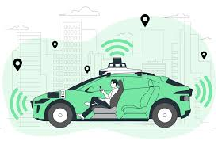

# 🚗 자율주행 프로젝트 (Autonomous Driving Project)

자율주행 시스템 개발을 위한 프로젝트입니다. 센서 데이터 처리, 객체 인식, 경로 계획 및 제어 알고리즘 등을 포함합니다.

---

## 📌 프로젝트 개요

- **목표**: 실시간 자율주행 차량 시스템 개발
- **기술 스택**: Python, ROS, OpenCV, TensorFlow/PyTorch, Carla Simulator 등
- **주요 기능**:
  - 센서 통합 (카메라, LiDAR 등)
  - 객체 탐지 및 추적
  - 차선 인식
  - 경로 계획 및 차량 제어

---

## 🛠️ 프로젝트 구조

```bash
autonomous-driving/
├── data/               # 수집된 센서 데이터
├── models/             # 학습된 모델 파일
├── scripts/            # 주요 코드 스크립트
├── ros_ws/             # ROS 워크스페이스
├── notebooks/          # 분석 및 실험용 Jupyter 노트북
├── README.md           # 프로젝트 설명 파일
└── requirements.txt    # 의존성 패키지 목록
